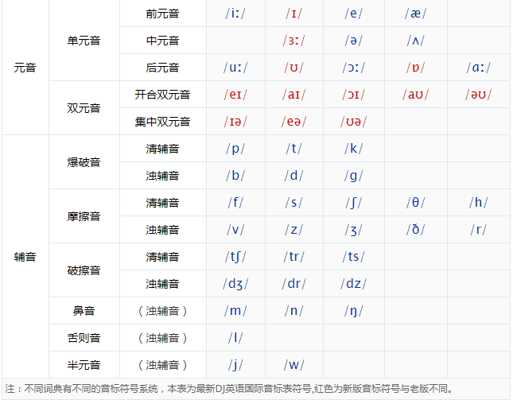

# 音标音纠正

### 清辅音在S前, 用对应的浊辅音发音

- **p -> b**    例： `speed` 、 `spring`
- **t -> d**    例： `stop`  、 `student`
- **k -> g**    例：  `sky`

### 相似读音的区别  :tongue:

| 听起来像 `丝` | 听起来像 `日` | 发音特点 |
|--------|--------| -----------|
|    /s/    |   /z/     | 平常说话的感觉 舌头中间 不碰上下颚 |
| /ʃ/  |  /ʒ/ | 下巴里面鼓起 气流抵达下巴最下面。有点 嘶嘶嘶 吃口哨的感觉 |
| /θ/  |  /ð/ | 牙齿咬住舌头发出声音 |

| 听起来像 `吃` | 听起来像 `织` | 发音特点 |
|--------|--------| -----------|
|    /tʃ/ `teacher` |  /dʒ/  | 卷舌 |
| /ts/    |  /dz/ | 平舌|

### 单词

- Entrance  英 [ˈentrəns]   美 [ˈentrəns]  n. 进入;入口，进口;进入方法，进入方式;入场权vt.使出神，使入迷;使喜悦，使狂喜
- Bill 账单
- Lemon  柠檬
- Seaweed	英 [ˈsi:wi:d]   美 [ˈsiˌwid]  海草，海藻，海带
- Refill	续 (续杯) 笔芯
- warm 	温暖
